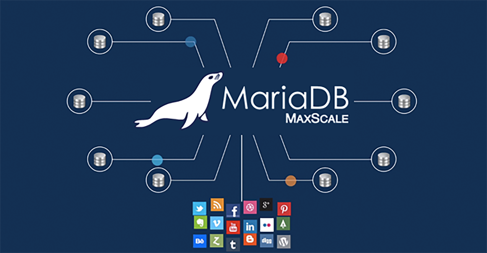

# Easy Learn to MariaDB

> 这是一个关于MariaDB数据库快速上手的操作教程，通过实例演示来掌握对于SQL语句的熟悉以及MariaDB的适用场景，都是干货。主要内容都是我的读书笔记，其中大部分的实例代码都是出自《MariaDB入门很简单》这本书，我对部分进行的重新的编辑，用于达到言简意赅的目的。比较喜欢纸质版图书的朋友，可以购买该书籍，很推荐仔细阅读。

- [1. 数据库基础]()
  - 数据库概述
  - Windows安装数据库
  - Linux安装数据库
- [2. 数据库维护](https://github.com/EscapeLife/easy-learn-MariaDB/blob/master/context/2.%E6%95%B0%E6%8D%AE%E5%BA%93%E7%BB%B4%E6%8A%A4.md)
  - 数据类型
  - 操作数据库
  - 增删改查表
  - 索引
  - 视图
  - 触发器
- [3. SQL查询语句]()
  - 查询数据
  - 增删改查数据
  - 运算符
  - 函数
  - 存储过程和函数
- [4. 数据库高级管理]()
  - 用户管理
  - 数据备份和还原
  - 日志
  - 性能优化
- [5. 应用和实战开发]()
  - Java访问数据库
  - PHP访问数据库
  - C#访问数据库
  - Python访问数据库
  - 驾校学员管理系统

