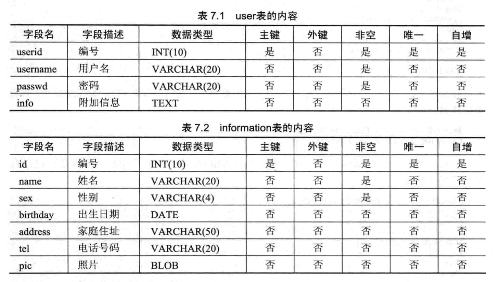

## 数据库维护

### 1.1 数据类型

> 数据类型是数据的一种属性，它可以决定数据的存储格式、有效范围和相应的限制。

- **整数类型**

| 数据类型 | 包含的种类 |
| -------- | -------- |
| 整数类型 | MySQL: `integer`/`smallint`；扩展: `tinyint`/`mediumint`/`bigint` |


- **浮点数类型和定点数类型**

| 数据类型 | 包含的种类 | 注意要点 |
| -------- | -------- | -------- |
| 浮点数类型 | 单精度(`float`)/双精度(`double`) | `M`为精度(数据总长度)；`D`为标度(小数点精度) |
| 定点数类型 | `decimal(M,D)`或`dec(M,D)` | `decimal`和`double`的取值范围相同，但`decimal`由`M`和`D`决定 |


- **日期与时间类型**

| 数据类型 | 包含的种类 |
| -------- | -------- |
| 日期与时间类型 | `year`/`date`/`time`/`datetime`/`timestamp` |
| `year` | 插入数值的格式`YYYY`；超过取值范围的年份，会插入0000，查询显示为空 |
| `date` | 插入数值的格式`YYYY-MM-DD`；分隔符可以为任意特殊字符；`current_date`和`now()`表示当前日期 |
| `time` | 插入数值的格式`D HH:MM:SS`，如`2 20:20`表示`68:20:00`；`current_time`和`now()`表示当前时间 |
| `datetime` | 插入数值的格式`YYYY-MM-DD HH:MM:SS`；分隔符可以为任意特殊字符；`now()`表示当前日期和时间 |
| `timestamp` | 大致与`datetime`使用方法类似，但是取值范围比较小；`timestamp`可以根据时区来显示日期和时间 |


- **字符串类型**

| 数据类型 | 对于解释 |
| -------- | -------- |
| `char` | 定长字符串，取值范围`0~255` |
| `varchar` | 变长字符串，取值范围`0~65535` |
| `text` | 包含类型`tinytext`/`text`/`mediumtext`/`longtext` |
| `enum` | 枚举类型的定义格式为`enum('value1'， 'value2', ...)`；最多取值范围为`65535`个值 |
| `set` | 基本形式和`enum`类型一样，但值可以为列表中的一个或多个元素组成；最多只能有`64`个元素组成 |


- **二进制类型**

| 数据类型 | 对于解释 |
| -------- | -------- |
| 二进制类型 | `binary`/`varbinary`/`bit`/`tinyblog`/`blob`/`meduimblob`/`longblob` |
| `blob` | `blob`类型主要用来存储图片、PDF文档等二进制文件 |
| `binary` | `binary`/`varbinary`/`bit`类型都是在创建时指定最大长度 |


> 常见问题以及解答

- **【问题1】MariaDB中什么数据类型能够存储路径？**
  - `MariaDB`中可以使用`char`、`varchar`和`text`来存储路径。但是，如果路径中使用`\`符号时会被自动过滤掉。可以使用`/`或`\\`来代替，这样`MariaDB`就不会自动过滤路径的分隔符号了。

- **【问题2】MariaDB中如何使用布尔类型？**
  - 在`SQL`标准中，存储`bool`和`boolean`类型。`MariaDB`为了支持`SQL`类型，也可以定义`bool`和`boolean`类型，但最后都会被转换成`tinyint(1)`格式进行保存。因此，创建表的时候将一个字段定义为`bool`和`boolean`，数据库中真实定义的是`tinyint(1)`格式。

- **【问题3】MariaDB中如何存储JPG图片和MP3音乐？**
  - 一般情况下，数据库中不直接存储图片和音频文件，而是存储图片和音频文件的路径。如果有需要在`MariaDB`中存储，就选择`blob`类型，因为`blob`类型可以用来存储二进制类型的文件。

-----------

### 1.2 操作数据库

> 数据库是指长期存储在计算机内、有组织的和可共享的数据集合。

- **数据库操作**
  - **创建：**`create database 数据库名;`
  - **查看：**`show databases;`
  - **删除：**`drop database 数据库名;`

- **数据库引擎**
  - **查看：**`show engines;`

> 光说不练假把式

- **【练习】登录数据库系统之后，创建student和teacher数据库，之后删除teacher数据库**

```sql
-- 1.登录数据库
bash> mysql -u'mysql' -p'admin'

-- 2.查看数据库已存在的数据库
sql> show databases;

-- 3.查看数据库系统支持的存储引擎类型
-- Transactions:事务处理；XA分布式交易处理规范；Savepoints:保存点
sql> show engines;
sql> show variables like 'storage_engine';

-- 4.创建指定数据库
sql> create database student;
sql> create database teacher;

-- 5.删除指定数据库
sql> drop database teacher;
```

> 常见问题以及解答

- **【问题1】如何选择存储引擎？**
  - 同一个数据库中可以使用多种存储引擎的表。如果一个表要求较高的事务处理，可以选择InnoDB存储引擎。这个数据库中可以将查询要求比较高的表选择MyISAM存储引擎。如果该数据库中需要一个用于查询的临时表，可以选择MEMORY存储引擎。


- **【问题2】如何修改默认存储引擎？**
  - 在MariaDB的安装目录下能够找到一个名为my.ini配置文件，通过修改default-storage-engine字段更改默认存储引擎。注意，该配置文件只有重启服务后才会生效。

-----------

### 1.3 增删改查表

> 表是数据库存储数据的基本单位，一个表包含若干个字段或记录。


- **约束规范**
  - **主键(primary key)**
  - 主键必须为唯一的
  - 主键的值是非空的
  - 主键可以是单一的字段，也可以使多个字段的组合
  - **外键(foreign key)**
  - 外键用于建立表与表之间的关系，可以为空值
  - 外键必须依赖于数据库中已经存在的父表的主键，且数据类型必须一致
  - **非空约束(not null)**
  - 非空性是指字段的值不能为空值
  - **唯一性约束(unique)**
  - 唯一性是指所有记录中该字段的值不能重复出现
  - **自动增加(auto_increment)**
  - 用于为表中插入的新纪录自动生成唯一的ID值
  - 约束的字段必须为主键的一部分，且该字段可以是任意整数类型
  - **默认值(default)**
  - 不指定的值的时候自动添加默认值

- **创建数据库**
  - `create table 表名 (属性 类型);`

- **查看数据库**
  - `desc 表名;`
  -`show create table 表名;`

- **修改数据库**
  - **修改表名：**`alter table 旧表名 rename [to] 新表名;`
  - **修改字段：**`alter table 表名 modify 属性名 数据类型;`
  - **修改位置：**`alter table 表名 modify 属性名1 数据类型 first|after 属性名2;`
  - **修改字段：**`alter table 表名 change 旧属性名 新数据类型;`
  - **增加字段：**`alter table 表名 add 属性名1 数据类型 [完整性约束] [first|after 属性名2];`
  - **删除字段：**`alter table 表名 drop 属性名;`
  - **删除外键：**`alter table 表名 drop foreign key 外键别名;`
  - **存储引擎：**`alter table 表名 engine='存储引擎名';`

- **删除数据库**
  - `drop table 表名;`

> 光说不练假把式

- **【练习1】将在school数据库创建一个teacher表**
  - 创建school数据库
  - 创建teacher表并查看表结构
  - 将teacher表的name字段的数据类型改为varchar(30)
  - 将birthday字段的位置改到sex字段前面
  - 将num字段改名为t_id
  - 将teacher表的address字段删除
  - 在teacher表中增加名为wages的字段，数据类型为float
  - 将teacher表改名为teacherInfo
  - 将teacher表的存储引擎更改为MyISAM类型


```sql
-- 1.创建school数据库
sql> create database school;

-- 2.创建teacher表并查看表结构
sql> use school;
sql> create table teacher(
  ->   id int(4) not null unique primary key auto_increment,
  ->   num int(10) not null unqiue,
  ->   name varchar(20) not null,
  ->   sex boolean not null,
  ->   birthday datetime,
  ->   langages varchar(20) default 'English',
  ->   address varchar(50)
  -> );
-- 简单和详细查看表结构
sql> desc school;
sql> show create table school;

-- 3.将teacher表的name字段的数据类型改为varchar(30)
sql> alter table teacher modify name varchar(30) not null;

-- 4.将birthday字段的位置改到sex字段前面
sql> alter table teacher modify birthday datetime after name;

-- 5.将num字段改名为t_id
sql> alter table teacher change num t_id int(10) not null;

-- 6.将teacher表的address字段删除
sql> alter table teacher drop address;

-- 7.在teacher表中增加名为wages的字段，数据类型为float
sql> alter table teacher add wages float first;

-- 8.将teacher表改名为teacherInfo
sql> alter table teacher rename teacherInfo;

-- 9.将teacher表的存储引擎更改为MyISAM类型
sql> alter table teacherInfo engine=MyISAM;
```

- **【练习2】创建department和worker表**
  - 在example数据库下创建deparment和worker表
  - 删除deparment表


```sql
-- 1.在example数据库下创建deparment表
sql> use example;
sql> create table department(
  ->   d_id int(4) not null unique,
  ->   d_name varchar(20) not null nuique,
  ->   function varchar(50),
  ->   address varchar(50),
  ->   primary key(d_id)
  -> );

-- 2.在example数据库下创建worker表
sql> create table woker(
  ->   id int(4) not null unique primary key auto_increment,
  ->   num int(10) not null unique,
  ->   d_id int(4),
  ->   name varchar(20) not null,
  ->   sex varchar(4) not null,
  ->   birthday date,
  ->   address varchar(50),
  ->   constraint worker_fk foreign key(d_id) references department(d_id)
  -> );

-- 3.删除deparment表，提示存在外间约束
sql> drop table department;

-- 4.删除worker表的外键约束
sql> alter table worker drop foreign key worker_fk;

-- 5.重新删除deparment表
sql> drop table department;

-- 补充: 多外键的设定
sql> create table example2(
  ->   id int primary key,
  ->   stu_id int,
  ->   course_id int,
  ->   constraint c_fk foreign key(stu_id, course_id) references example1(stu_id, course_id)
  -> );
```

> 常见问题以及解答

- **【问题1】如何设置外键？**
  - 子表的外键必须依赖父表的某个字段，因此父表必须优先于子表创建。而且，父表中的被依赖字段必须是主键或者组合主键的一个。如果不满足这样的条件，子表将不能创建成功。

- **【问题2】为什么自增不能设置默认值？**
  - 自增字段必须是主键的一部分，而且一个表有且只能有一个自增字段，它可以为任意合法的整数类型。自增字段是没有默认值的，数值从1开始增加逐个增加。

- **【问题3】如何删除父表？**
  - 因为子表的外键约束限制了父表的删除，而且删除过程比较麻烦。
  - 第一种方法：先删除子表的外键约束，然后再删除父表，达到删除父表的目的。
  - 第二种方法：先删除子表再删除父表，这样完全可以达到删除父表的目的，但是必须要牺牲子表。

-----------

### 1.4 索引

> 索引是一种特殊的数据库结构，可以用来快速查询数据库表中的特定记录，提高数据库性能。

- **索引的含义**
  - 在MariaDB中，索引的数据类型都可以被索引。索引由数据库表中一列或多列组合而成，用于提高查询的速度。通过索引，查询数据时可以不必读完记录的所有信息，而只是查询索引列。否则，数据库系统将读取每条记录的所有信息进行匹配。
  - 不同的存储引擎定义了每个表的最大索引数和最大索引长度。所有存储引擎对每个表至少支持16个索引，总索引长度至少256字节。索引有两种存储类型，包括B型树(`btree`)和哈希(`hash`)索引。InnoDB和MyISAM存储引擎支持BTREE索引，MEMORY存储引擎支持HASH索引和BTREE索引，默认为前者。

- **索引的优缺点**
  - [优点] 创建索引的最主要原因是，其可以提高检索数据的速度
  - [优点] 对于有依赖关系的子表和父表之前的联合查询时，可以提高查询速度
  - [优点] 使用分组和排序子句进行数据查询时，显著节省查询中分组和排序的时间
  - [缺点] 创建和维护索引需要消耗时间，消耗时间的数量随着数据量的增加而增加
  - [缺点] 索引需要占用物理空间，每一个索引要占一定的物理空间
  - [缺点] 增加、删除和修改数据时，要动态的维护索引，造成数据的维护速度降低了

- **索引的分类**
  - **普通索引：**不需要附件任何限制条件；且可以创建在任何数据类型上
  - **唯一性索引：**使用unique参数设置唯一性索引；该索引的值必须是唯一的；主键是一种特殊的唯一索引
  - **全文索引：**使用fulltext参数设置全文索引；只能创建在char/varchar/text字段上；查询数据量较大时使用
  - **单列索引：**在表的单个字段上创建索引；单列索引可为普通索引/唯一性索引/全文索引，保证只有一个字段
  - **多列索引：**在表的多个字段上创建索引；只有查询条件中使用了第一个字段时，索引才会被使用
  - **空间索引：**使用spatial参数设置空间索引；只能建立在空间数据类型上；空间数据类型geometry/point等

- **索引的设计原则**
  - 选择唯一性索引
  - 为经常需要排序、分组和联合操作的字段建立索引
  - 为长作为查询条件的字段建立索引
  - 限制索引的数目
  - 尽量使用数据量少的索引
  - 尽量使用前缀来索引
  - 删除不再使用或者很少使用的索引

- **索引创建和删除方式**
  - [创建] 创建表的时候创建索引
  - `create table 表名 ... [unique|fulltext|spatial] index [别名] (属性名[(长度)]) [asc|desc])`
  -  [创建] 在已经存在的表上创建索引
  - `create [unique|fulltext|spatial] index 索引名 on 表名(属性名 [(长度)] [asc|desc])`
  -  [创建] 用alter语句来创建索引
  - `alter table 表名 add [unique|fulltext|spatial] index 索引名(属性名 [(长度)] [asc|desc])`
  - [删除] 删除已有的索引
  - `drop index 索引名 on 表名`

> 光说不练假把式

- **【练习1】在job数据库中创建user和information表**
  - 创建job数据库
  - 创建user表
  - 在user表中，存储引擎为MyISAM类型
  - 在user表中，userid字段上创建名为index_uid的唯一性索引，降序排列
  - 在user表中，username和passwd字段创建名为index_user的多列索引
  - 在user表中，info字段上创建名为index_info的全文索引
  - 创建information表
  - 在information表中，name字段创建名为index_name的单列索引，索引长度为10
  - 在information表中，birthday和address字段上创建名为index_bir的多列索引，判断索引的使用情况
  - 用alter语法在id字段上创建名为index_id的唯一性索引，升级排列
  - 删除user表的index_user索引
  - 删除information表上的index_name索引



```sql
-- 1.创建job数据库
sql> create database job;

-- 2.创建user表
sql> create table user(
  ->   userid int(10) not null unique primary key auto_increment,
  ->   username varchar(20) not null,
  ->   passwd varchar(20) not null,
  ->   info text,
  ->   unique index index_uid(userid desc),
  ->   index index_user(username, passwd),
  ->   fulltext index index_info(info)
  -> )engine=MyISAM;

-- 3.创建information表
sql> create table information(
  ->   id int(10) not null unique primary key auto_increment,
  ->   name varchar(20) not null,
  ->   sex varchar(4) not null,
  ->   birthday date,
  ->   address varchar(50),
  ->   tel varchar(20),
  ->   pic blob
  -> );

-- 4.name字段创建名为index_name的单列索引(create index)
sql> create index index_name on information(name(10));

-- 5.birthday和address字段上创建名为index_bir的多列索引(create index)
sql> create index index_dir on information(birthday, address);

-- 6.id字段上创建名为index_id的唯一性索引(alter table)
sql> alter table information add index index_id(id asc);

-- 7.删除user表的index_user索引
sql> drop index index_user on user;

-- 8.删除information表上的index_name索引
sql> drop index index_name on information;
```

```sql
-- 查询索引是否被使用了
sql> explain select * from index1 where id=1 \G;
```

> 常见问题以及解答

- **【问题1】为什么创建索引导致插入速度变慢？**
  - 索引可以提高查询的速度，但是会影响到插入记录的速度。因为，向有索引的表中插入记录时，数据库系统会按照索引进行排序。当有大量数据插入时，尤为明显。这种情况下，最好的办法是先删除表中的索引，然后插入数据，插入完成之后在创建索引。

- **【问题2】为什么创建的多列索引没有使用到？**
  - 使用多列索引时一定要注意，只有使用了索引中的第一个字段时才会触发索引。如果没有使用索引中的第一个字段，那么这个所列索引就不会起作用了。因此，在优化查询速度时，可以考虑多列索引。

-----------

